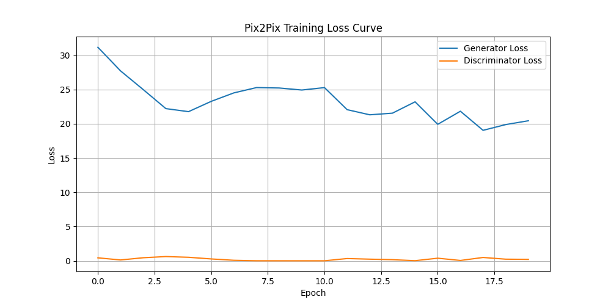

# 🌞 Generating Daylight Images from Night/Low-Light Images Using Deep Learning

## 📖 Project Overview

This project was developed during the **DeLTA 2026 Summer Internship and Project-Certificate Program**, organized by the **Computer Vision and Biometrics Lab (CVBL), Indian Institute of Information Technology Allahabad (IIIT Allahabad)**.

The objective of this project is to generate **daylight-like images from night or low-light images** using the **Pix2Pix Generative Adversarial Network (GAN)**. The model learns the mapping between paired low-light and daylight images, enabling realistic image enhancement while preserving important scene details.

---

## 🎯 Objectives

- Generate daylight-like images from low-light or night images.
- Improve image visibility while preserving structural details.
- Implement image-to-image translation using the Pix2Pix GAN architecture.
- Evaluate the generated outputs using standard image quality metrics.

---

## 🛠️ Technologies Used

- Python
- TensorFlow
- Keras
- OpenCV
- NumPy
- Matplotlib
- Google Colab

---

## 🧠 Deep Learning Model

- **Model:** Pix2Pix GAN
- **Generator:** U-Net
- **Discriminator:** PatchGAN

---

## 📂 Dataset

This project uses the **LOL (Low-Light) Dataset**, which contains paired low-light and normal-light images for supervised image-to-image translation.

> **Note:** The dataset is not included in this repository due to its size and licensing considerations.

---

## 📊 Qualitative Results

Each comparison image contains:

- **Left:** Low-Light Input Image
- **Center:** Generated Daylight Image (Pix2Pix Output)
- **Right:** Ground Truth Daylight Image

### Comparison 1


---

### Comparison 2


---

### Comparison 3


---

### Comparison 4


---

### Comparison 5


---

### Comparison 6


---

### Comparison 7


---

### Comparison 8


---

### Comparison 9


---

### Comparison 10


---

## 📈 Evaluation Metrics

The performance of the generated images was evaluated using:

- **PSNR (Peak Signal-to-Noise Ratio)**
- **SSIM (Structural Similarity Index Measure)**

These metrics assess the similarity between the generated images and the corresponding ground truth daylight images.

---

## 📉 Training Loss Curve

The figure below illustrates the training progress of the Pix2Pix model by showing the Generator and Discriminator loss values across training epochs.



## 📁 Repository Contents

## 📁 Repository Structure

```text
daylight-image-generation-pix2pix/
│
├── README.md
├── Pix2Pix_Daylight_Generation.ipynb
├── Final_Project_Report.pdf
├── pix2pix_loss_curve.png
├── Checkpoints/
│   ├── Generator checkpoints
│   └── Discriminator checkpoints
└── Results/
    ├── comparison1.png
    ├── ...
    ├── comparison10.png
    └── metrics.txt
```

---

## 🚀 Getting Started

1. Clone this repository.
2. Open the notebook in **Google Colab** or **Jupyter Notebook**.
3. Install the required Python libraries.
4. Download the LOL Dataset and update the dataset path.
5. Run the notebook cells to train or test the Pix2Pix model.

---

## 📌 Future Improvements

- Train on larger and more diverse datasets.
- Improve image quality using advanced GAN architectures such as CycleGAN or diffusion-based models.
- Optimize the model for real-time image enhancement.
- Support higher-resolution image generation.

---

## 👨‍💻 Author

**Ayush Kushwaha**

Bachelor of Technology (Computer Science & Engineering)

---

## 🙏 Acknowledgements

This project was completed during the **DeLTA 2026 Summer Internship and Project-Certificate Program**, organized by the **Computer Vision and Biometrics Lab (CVBL), Indian Institute of Information Technology Allahabad (IIIT Allahabad)**.

I sincerely thank the mentors and coordinators for their guidance, support, and valuable learning opportunities throughout the internship.

---

## ⭐ If you found this project interesting, consider giving this repository a Star!
